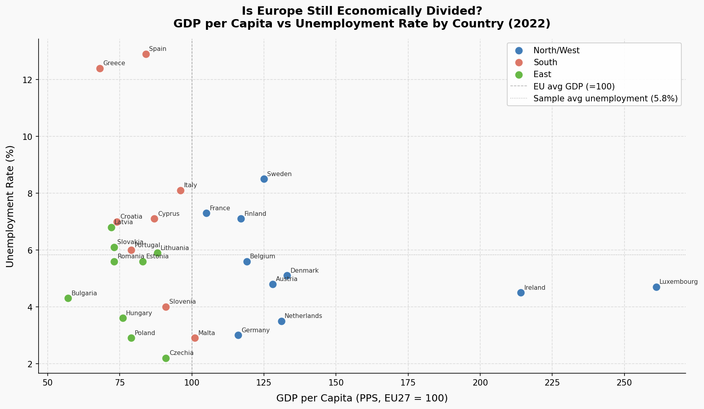

# europe-inequality-python
Exploratory analysis of the North-South economic divide in Europe using Eurostat GDP and unemployment data (2022). Python, pandas, matplotlib.
# Europe Inequality Analysis

## Question
Is Europe still economically divided — North vs South?

## Data
| Dataset | Source | Year |
|---|---|---|
| GDP per capita (PPS, EU27=100) | Eurostat `nama_10_pc` | 2022 |
| Unemployment rate (%) | Eurostat `une_rt_a` | 2022 |

27 EU member states included.

## Tools
- Python 3
- pandas
- matplotlib

## Key Findings
- **The North-South divide is real and visible.** Spain and Greece stand out with the highest unemployment rates (12.9% and 12.4%) and GDP per capita well below the EU average.
- **Higher GDP generally means lower unemployment** — a negative relationship is clearly visible across the scatter plot.
- **Italy is a partial exception:** GDP above the Southern average but unemployment closer to Mediterranean neighbors, reflecting deep internal regional inequality.
- **Eastern Europe complicates the story:** Czechia, Poland, and Hungary have very low unemployment despite modest GDP — driven by low wages and manufacturing export reliance, not high productivity.
- **Ireland's GDP (214, EU=100) is an outlier** inflated by multinational profit-booking, not genuine productivity.

## Why It Matters
The divide has direct implications for EU cohesion policy, fiscal transfers, and the ongoing debate over whether a monetary union can function durably across economies at such different stages of development. The 2010s Eurozone crisis exposed these fault lines; the data shows they haven't fully closed.

## Files
```
europe-inequality-python/
├── europe_inequality.ipynb   # Full analysis notebook
├── europe_divide_scatter.png # Main chart
└── README.md
```

## Chart

